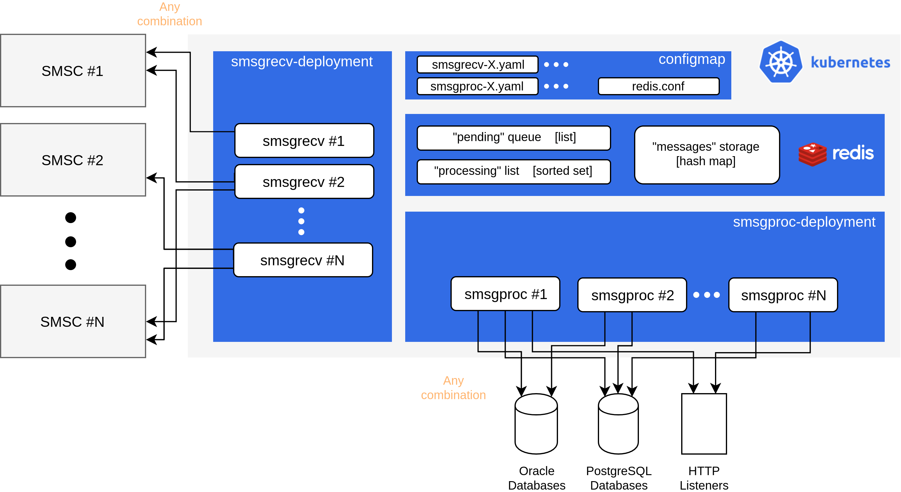

# smsg
smsg (SMS Gateway) is a microservice stack for receiving short messages from one or multiple SMSC and forwarding them to their defined destinations.

## Architecture

## Concepts

##### Directives
*Directives* are used for judging messages by source, destination, or both. When a message fits into the directive's match range, it gets sent to a *Connection* specified by the `connection_identifier`.
Messages are checked against directives in down-to-top order, last specified directives take precedence over former directives.
##### Connections
*Connections* are identified by their `identifier` and they specify `connection_type` (HTTP/Postgres/Oracle), format of transmission, along with other details. *Directives* refer to the connections with their `connection_identifier` field, which specifies connection's `identifier`.

## Deployment

1. Build smsgrecv and smsgproc binaries from the Go source codes that are in the `./src`.
2. Add binary files to their respective `./docker/smsgxxxx` directories and build Docker images with `docker build`.
3. Edit `smsgrecv.yaml` and `smsgproc.yaml` that are in the `./k8s/configmap.yaml`. See `./src/smsgrecv/config/demo-config.yaml` and `./src/smsgproc/config/demo-config.yaml` for configuration examples.
4. Deploy `configmap.yaml`, `redis.yaml`, `smsgrecv-deployment.yaml`, and `smsgproc-deployment.yaml` to your Kubernetes cluster.

## License

This project is licensed under the MIT License - see the [LICENSE](LICENSE) file for details
